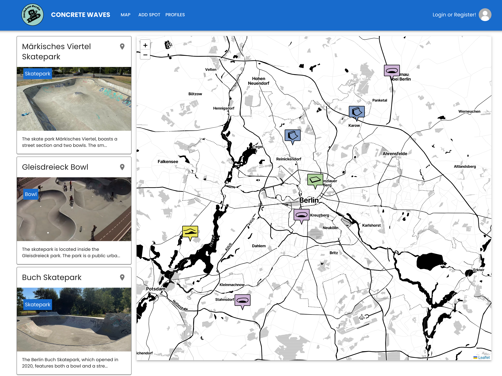

# Concrete Waves Berlin



## Presentation:

[Youtube Presentation](https://www.youtube.com/watch?v=DGmuJAFcILM&list=PLHZ4c16wSRSvCnZchOVMyTqcSHXGdIP2h&index=6&ab_channel=FelixDrawe)

## Table of Contents

- [Concrete Waves Berlin](#concrete-waves-berlin)
  - [Presentation:](#presentation)
  - [Table of Contents](#table-of-contents)
  - [Project Overview](#project-overview)
  - [Objectives](#objectives)
  - [Technical Requirements](#technical-requirements)
  - [Functionality / Features](#functionality--features)
  - [Code and Organization](#code-and-organization)
    - [Backend:](#backend)
      - [App Listings:](#app-listings)
      - [App Users:](#app-users)
    - [Frontend:](#frontend)
  - [Distinctiveness and Complexity](#distinctiveness-and-complexity)
  - [Installation Instructions](#installation-instructions)
    - [Backend Installation](#backend-installation)
    - [Frontend Installation](#frontend-installation)
    - [There are already testprofiles created:](#there-are-already-testprofiles-created)

## Project Overview

The purpose of this project is to help users find locations on a map where they can surf-skate. Surf-skating is similar to skateboarding, but there are different requirements for a good spot. Existing platforms like Google Maps only provide a few spots designated for skateboarding, and they are not well organized. The target audience for this project are surf-skaters who are searching for good spots, wish to add spots to their favorites list, and want to contribute to the map by adding new spots.

## Objectives

The objectives of this project were to:

- Create a list and a map-based view of surf skate spots, along with categorization.
- Develop detail pages for all spots, allowing users to view pictures and providing a unified system for rating spots based on factors like difficulty level and conditions.
- Implement user interactivity:
  - Users can register, create a profile, and add spots they find to the map.
- Ensure simplicity for the user:
  - A map-based view where users can easily add a spot using a predefined form, maintaining a unified and user-friendly interface.
- Implement different levels of registration, with varying access levels:
  - Visitors can browse listings and view user profiles.
  - Registered users have access to a favorite map view and can add spots to their favorites.
  - To prevent spam and enhance credibility, users can create a personal profile with additional information. Only users with a profile can add spots to the map. User contributions are displayed with their profile name rather than their account username.

## Technical Requirements

**Programming Languages:** Python, Javascript  
**Database:** SQLite  
**Front-end Tools:** Django, React, HTML, CSS, Material UI  
**Back-end Tools:** Django  
**Additional Libraries and Tools:** Django Rest Framework, Django Signals, React Leaflet for the Map, Djoser for token-based registration

## Functionality / Features

- **Home Page/Map:** Displays all spots on the map and in list view.
- **Favorites:** Visible only when the user is logged in. Similar to the map, but only shows favorite spots.
- **Add Spot:** Users can add a spot if they are signed in and have created a profile. The form includes different checkboxes and a map for user input.
- **Profiles:** Shows all user profiles that have created a map and provides links to the spots they have added.
- **Profile Detail View:** If a user has contributed to the map, they have a detailed view showing their profile data and the spots they have added.
- **Spot Detail View:** By clicking on a picture or map icons, visitors can navigate to the detail view of spots. This view includes a gallery and a more detailed zoomed map. If a user account is created, users can add spots to their favorites. If they have also created a profile and added the spot, they can delete or edit it here.
- **Login/Register:**
  - If logged out, the upper right side displays "Login or Register". After logging in, the user is redirected back to the map.
  - If already registered and logged in, it displays "Welcome back, [username]" and provides options to create a profile or logout.
- **Create Profile:** Users can upload pictures and other data, create a profile name (displayed to the public), and access their profile detail page from here.

## Code and Organization

### Backend:

Consists of 2 Django Apps:

#### App Listings:

- **Folder Listings:**

  - `models.py`: Includes one model for map listings and one for favorites.

- **Folder api inside Listings:**
  - 2 files:
    - `serializers.py`
    - `views.py` to create the API.

#### App Users:

- **Folder Users:**

  - `models.py`: Includes 2 models. One uses `AbstractUser` to create a user, the other creates profiles/accounts.

- ## **Folder api inside Users:**

2 files: - `serializers.py` - `views.py` to create the API.

### Frontend:

- React, built with Vite.
- Most files are self-explanatory by their name:
  - Add spot
  - Header
  - Home (directs to Map)
  - ListingDetail
- CSS is written into the `.jsx` files.

## Distinctiveness and Complexity

I wanted to create an app that would be useful to others and that I could further develop and possibly release online. I believe an app that utilizes geolocation data differs significantly from previous tasks in CS50Web.

The focus is also on unexplored and lesser taught areas, including:

- Creating user accounts and logins with token authentication.
- Developing more complex upload forms that include more checkboxes and options for uploading images and map data.
- Separating the frontend into React and backend into Django and exchanging data via API/Django Rest Framework instead of mainly using Django with some Javascript.
- Implementing advanced React, utilizing immer's produce function to create an immer-ized reducer. Additionally, the code utilizes React Context for state management, allowing for data sharing across components.
- Integrating a new library MUI for responsive layout.
- Incorporating more complex pages for spot listings, user listings, and detail pages, all dynamic, updating immediately after input.
- Limiting user access based on authentication level.

## Installation Instructions

### Backend Installation

To install the backend components for Concrete Waves Berlin, follow these steps:

1. Open one Terminal for the backend. Ensure you are in the project directory (concrete_waves-main) and move to the backend folder.

   ```bash
   cd backend
   ```

2. Check the directory structure to confirm setup:

   ```bash
   ls
   ```

3. Create a virtual environment for Python packages:

   ```bash
   python3 -m venv .venv
   ```

4. Activate the virtual environment:

   ```bash
   source .venv/bin/activate
   ```

5. Install the required Python packages:
   ```bash
   pip install -r requirements.txt
   ```

### Frontend Installation

For setting up the frontend of the project, proceed with the following:

1. Open a second Terminal for the frontend. Ensure you are in the project directory (concrete_waves-main) and move to the frontend folder:

   ```bash
   cd frontend
   ```

2. Install the necessary Node.js packages:
   ```bash
   npm install
   ```

Once both installations are complete, start the backend server with `python manage.py runserver` from the backend terminal, and the frontend development server with `npm run dev` from the frontend terminal.

### There are already testprofiles created:

Django-Admin:

superuser: admin

pw: admin

App Logins:

user:User1 / User2 / User3

pw: mypass123 / mypass234 / mypass345
